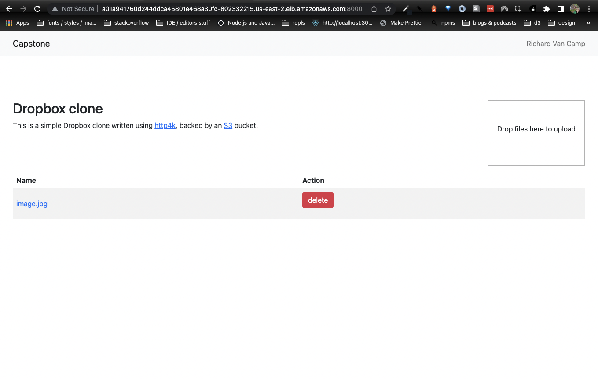

# Devops capstone


## Project

This is a simple app like dropbox (from the http4k examples) that allows you to save files to a s3 bucket.




Please see `images` for examples of the above.

The application has been deployed to EKS but is only available via the ingress url.

## Prerequisites

1. You must have AWS_CREDENTIALS env variable set to run the project locally. This includes the key and secret associated with the s3 bucket separated by a colon.
```
export AWS_CREDENTIALS=key:secret
```

2. To develop locally you also need Java 17 SDK installed.

## Getting started

You can run a number of useful commands with `make`: 
    
- `env` to check your have the required environment set
- `test` and `lint`for validating the application
- `run` to run the app locally with gradle
- `docker-build`, `docker-run`, and `docker-remove` to create a docker image and run it


## Releasing a new version

To create a new release, creating a new docker image to be deployed.

1. Go to the [new release page](https://github.com/RikuVan/devops-capstone/releases/new)
2. Create a version number and click "Generate release notes"
3. Click "Publish release"

## Changing infra

The infrastructure, the kubernetes cluster and s3 bucket, is created via [terraform](https://www.terraform.io/).

To change deploy the infrastructure you must have terraform, kubectl and aws clis installed. Then run `aws configure` to set up the aws credentials.

To apply changes to the infra:
```bash
terraform plan
terraform apply
```

Then make changes to the applications with kubectl
```bash
kubectl apply -f ./infra/k8s/.
```